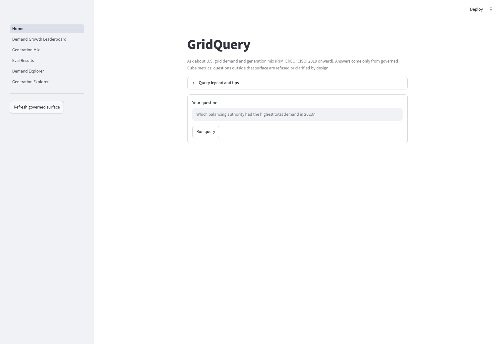
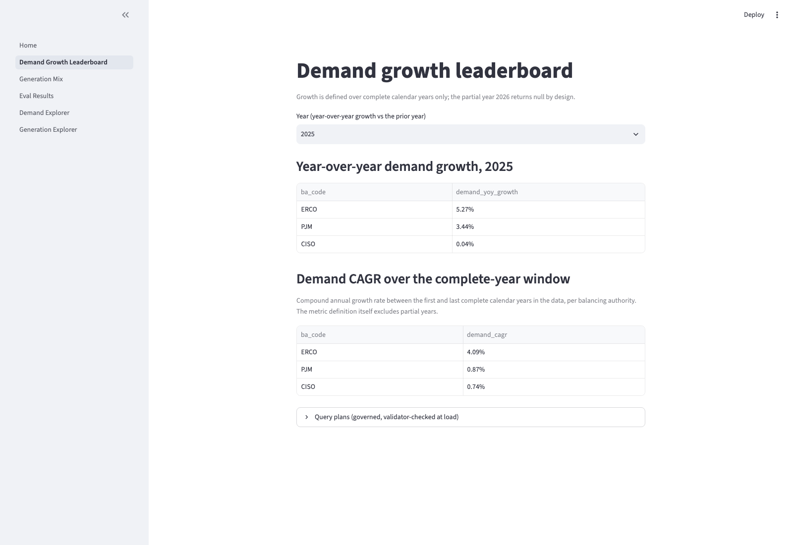
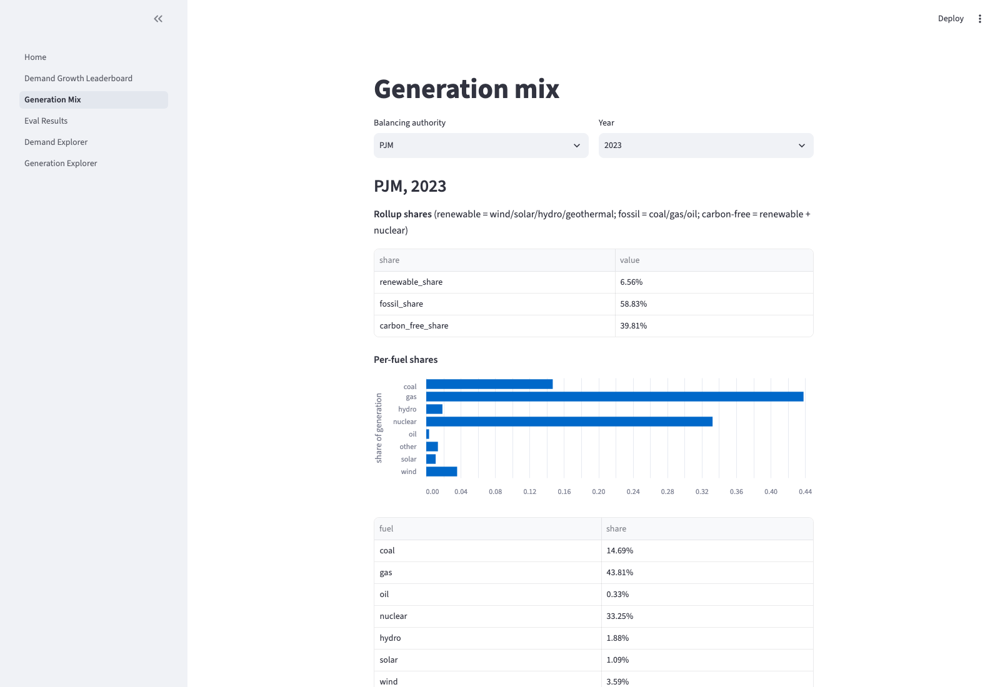
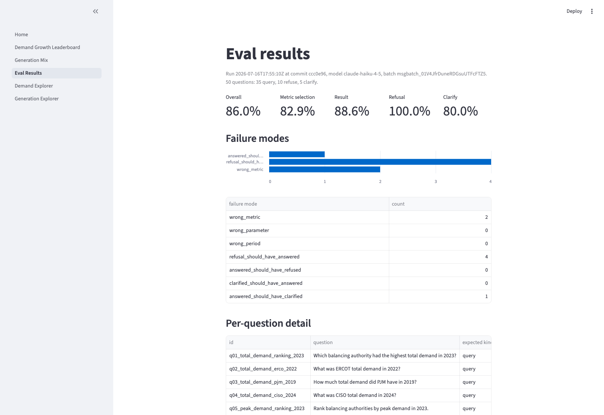
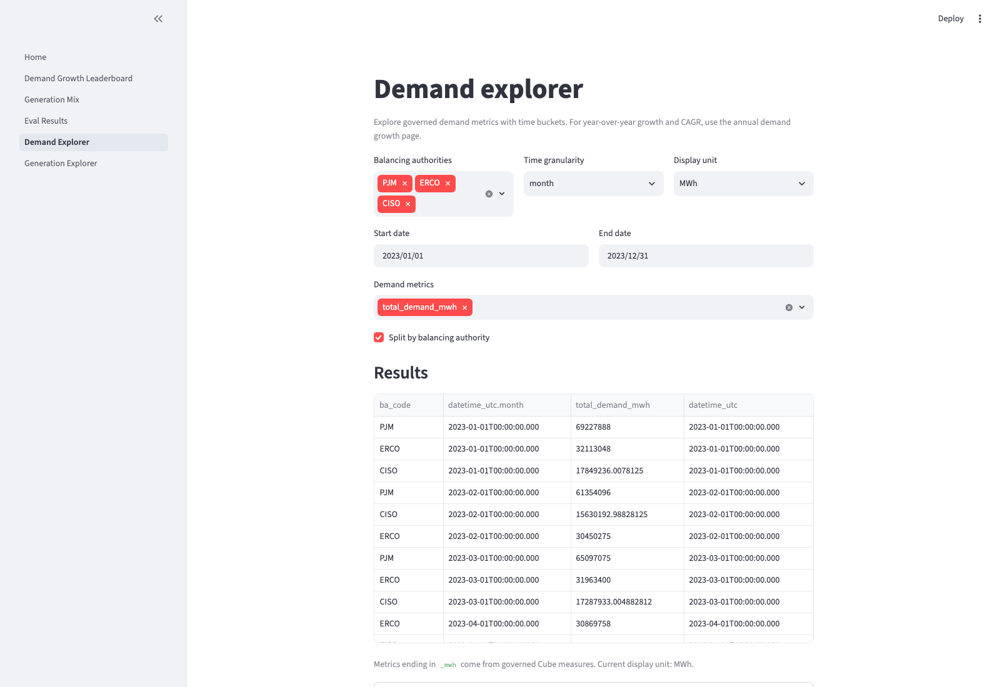
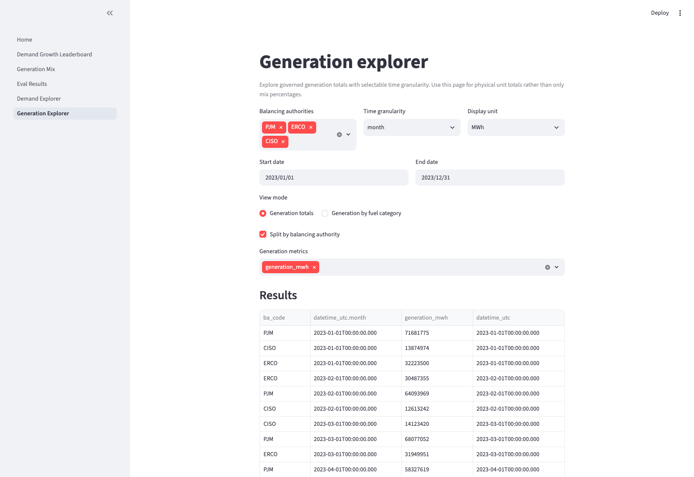

# GridQuery

GridQuery is a small governed data product over U.S. hourly grid data.

The core idea is simple: do not let an LLM invent metrics or write free-form SQL over raw tables. Instead, define trusted metrics once in a semantic layer, then let the LLM only select and parameterize those metrics.

## How to run in 3 commands

```bash
uv sync
make cube-up
make app
```

Then open the local Streamlit URL printed in your terminal.

## What this project is

This project implements an end-to-end analytics architecture:

- Ingestion from PUDL EIA-930 data with `dlt`
- Local storage and compute in DuckDB
- Transformation and tests in dbt Core
- Governed metric definitions in Cube
- Natural language interface that maps questions to governed metrics only
- Evaluation harness and Streamlit app as the next phases

The goal is architecture, governance, and evaluation. The goal is not model novelty.

## Why the semantic layer matters

The semantic layer is the trust boundary.

Without a semantic layer:
- The LLM can generate plausible but incorrect SQL
- Metric definitions drift between notebooks, dashboards, and prompts
- You cannot reliably audit how an answer was produced

With a semantic layer:
- Metric definitions are version-controlled and explicit
- Every answer is tied to a named governed metric
- Refusal is possible when a question is out of scope
- Evaluation can measure correctness against a known contract

In this project, Cube exposes the governed surface and the NL layer is constrained to that surface.

## How NL answering works

For each question, the pipeline is:

1. Build a grounded prompt from the governed Cube metadata and metric catalog.
2. Ask the model for one typed outcome: query, refuse, or clarify.
3. Validate the proposed query deterministically against governed rules.
4. Execute only validated plans via Cube `/v1/load`.
5. Render answers deterministically from result rows, including caveats.

Important guardrails:
- No raw SQL generation by the LLM.
- Out-of-scope questions are refused or clarified.
- Date and domain bounds are enforced in code.
- Numbers shown to users come from query results, not from the model text.

## Key learning points

This project demonstrates practical lessons for building trustworthy analytics with LLMs:

- **Governance beats prompt cleverness.** Prompt quality helps, but deterministic validation is what enforces integrity.
- **Refusal is a product feature.** Saying "not answerable with governed metrics" is better than guessing.
- **Evaluation is mandatory.** NL quality must be measured with a golden set and failure modes, not anecdotes.
- **Semantic contracts reduce ambiguity.** Shared typed schemas (`query | refuse | clarify`) align planner, validator, evaluator, and UI.
- **Architecture is modular.** If free-form NL needs to be cut, the same validator + executor + renderer can power parameterized queries.

## Current status

From `docs/ROADMAP.md`:

- Phase 1: complete
- Phase 2: complete
- Phase 3: complete
- Phase 4: complete (natural-language interface)
- Phase 5: complete (evaluation harness + report artifact)
- Phase 6: complete (Streamlit front end)

## Dataset and scope

- Source: PUDL analysis-ready outputs
- Primary dataset: EIA-930 hourly demand and generation by balancing authority
- BAs in scope: PJM, ERCO (ERCOT), CISO (CAISO)
- Core window starts in 2019 for fuel-mix analysis

Locked metric definitions and data handling decisions are tracked in `docs/ROADMAP.md` and `PRD.md`.

## Streamlit pages

- Home (NL query)
- Demand growth leaderboard (annual growth metrics)
- Generation mix (share metrics)
- Eval results
- Demand explorer (unit totals + time granularity)
- Generation explorer (unit totals + time granularity)

### Screenshots








## Known limitations (v1)

- This is a local, single-user build, not a production service.
- Weather normalization is out of scope for v1.
- Carbon-intensity proxy is deferred to future work.
- The LLM can still choose the wrong governed metric; this is measured in the eval harness phase, not assumed away.
- The demand growth page is intentionally annual-only; sub-annual exploration lives on the dedicated demand and generation explorer pages.

## Running the project

Core commands:

- `make land` - ingest data
- `make build` - run dbt build and tests
- `make cube-up` - start Cube semantic layer (Docker)
- `make cube-test` - semantic layer tests
- `make ask Q="Which balancing authority had the highest total demand in 2023?"` - ask NL interface
- `make nl-test` - NL tests

For full implementation details, see:

- `PRD.md`
- `docs/ROADMAP.md`
- `docs/metric_catalog.md`
- `docs/nl_interface.md`
